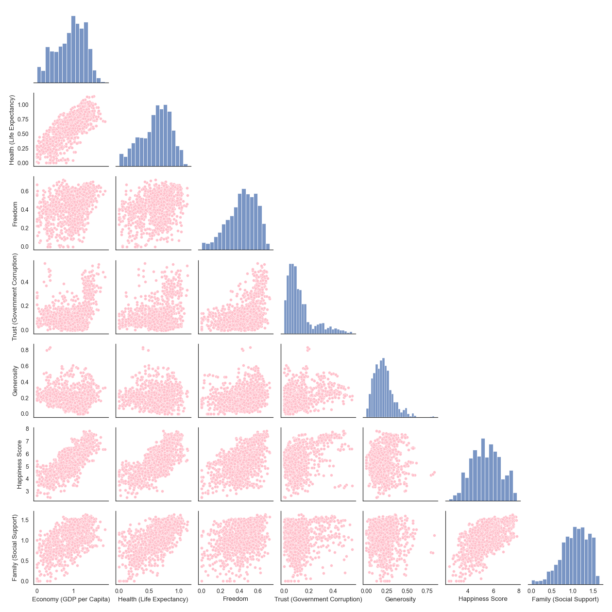
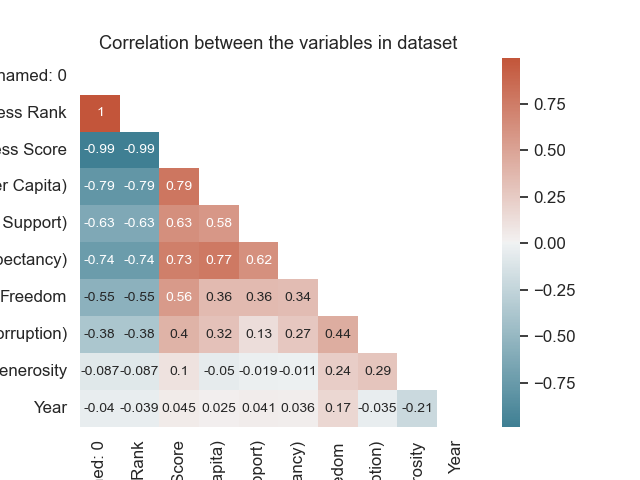

# **Group 47 - Interpreting Happiness**

## **1.0: Introduction**

As international students from Brazil, Iran, and Egypt, we have all been exposed to different economies and levels of governmental support. We know first hand how it affects our well-being, and we would like to explore this topic further to understand this relationship on a broad, international scale. 

We hope to shed light on the type of policies which are effective in promoting well-being, and which countries have been proficient at it. Such knowledge is imperative to empower our generation to use our democratic rights conscientiously in order to enact change and build a future that can support our well-being as global citizens.

Another reason we chose this dataset for our project is the sheer variety of visualizations we can build upon it. We hope that with the advanced visualization tools in Tableau, we can communicate our findings in a way that is easily interpreted by others. Each team member had their own research question that they were interested to explore more into. 

Anna started off by determining the main factors that help determine a country's happiness score. Consequently, Yahia was exploring which countries offered their citizens the best living standards between the years 2015-2021, as observed by surveys conducted over the years for happiness score, social support, economy, freedom, and government corruption. Lastly, Darya examined how the average global happiness index was affected by economy, life expectancy, and social support between the years 2015-2021.

## **2.0: Exploratory Data Analysis (EDA)**

Exploratory data analysis is the crucial process of doing preliminary analysis on data in order to find patterns, identify anomalies, test hypotheses, and double-check assumptions with the aid of summary statistics and graphical representations.

### 2.1: Pairplot of all the numeric columns

To start off, before doing any data wrangling we wanted to observe if our numeric columns are correlated. If so, what is the correlation between them. Hence, we used the pairplot to help us achieve that. Figure 1. seen below showcases that there is a high correlation between Life Expectancy, Economy, and Happiness Score. However, this figure has a lot of outliers in the correlations for the rest of the columns, which makes us unable to visualize the figure accurately.

*Figure 1. Pairplot of all numeric columns*

### 2.2: Correlation matrix for the numeric variables

We plotted a correlation matrix to be able to see how the columns are correlated numerically, which was missing in Figure 1. In Figure 2. as seen below, we can see that Happiness Score has the highest correlation with Economy (GDP per capita), followed by Health (Life Expectancy), and then Family (Social Support). Moreover, we can notice that there is a column named "Unnamed" that has a negative correlation with the rest of the dataset. Hence, this column has to be dropped when data wrangling.

*Figure 2. Correlation matrix of all numeric columns*

### 2.3: Scatterplot showing the correlation between Economy and Happiness Score between the years 2015-2022

Based on Figure 2, we wanted to analyze further how Economy and Happiness Score are correlated throughout the years 2015-2022. We used a scatter plot as it can clearly show the pattern over the years. In all subplot of Figure 3, there was a positive correlation throughout the years. This is important for future analysis since it might be interpreted that Economy could be the main factor affecting the Happiness Score. However, the subplot for the year 2022 was empty. This could be due to null values and missing data for the year 2022. Moreover, the surveys might have not been conducted yet for this year. Hence, we will be removing the year 2022 from our dataset.

*Figure 3. Scatterplot between Economy and Happiness Score throughout the years 2015-2022*

## **3.0: Research Question 1**

### What are the main factors that help determine a country's happiness score?

## **4.0: Research Question 2**

### What countries have offered their citizens the best living standards between 2015-2021, as observed by happiness score, social support, economy, freedom, and government corruption?

### **4.1: **

## **5.0: Research Question 3**

### How has life expectancy, economy, and social support contributed to the average global happiness index from 2015-2021?

## **6.0: Conclusion**

