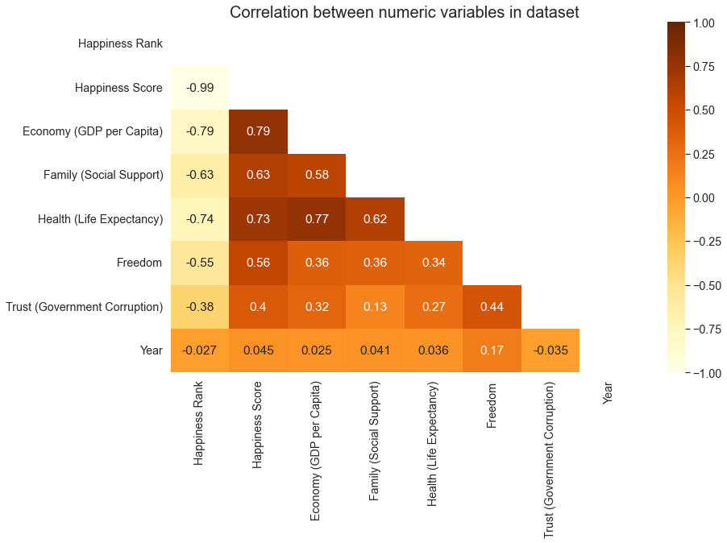
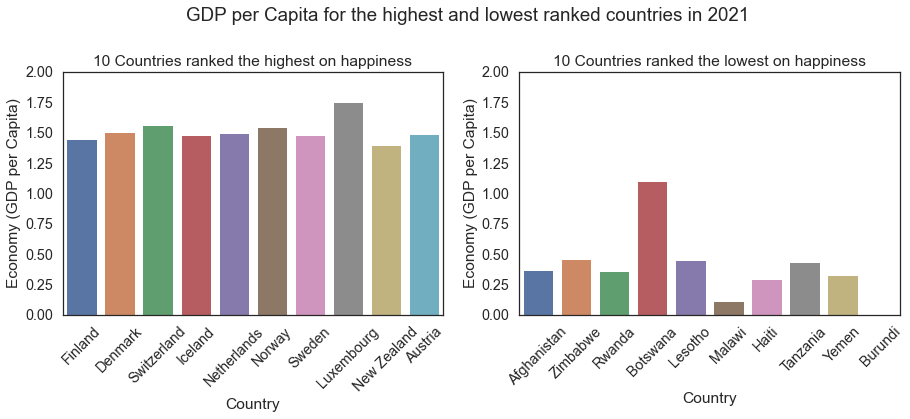
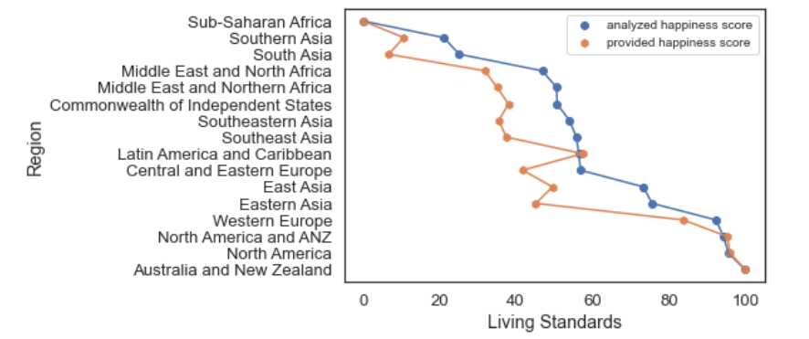

# **Group 47 - Interpreting Happiness**

## **1.0: Introduction**

As international students from Brazil, Iran, and Egypt, we have all been exposed to different economies and levels of governmental support. We know first hand how it affects our well-being, and we would like to explore this topic further to understand this relationship on a broad, international scale. 

We hope to shed light on the type of policies which are effective in promoting well-being, and which countries have been proficient at it. Such knowledge is imperative to empower our generation to use our democratic rights conscientiously in order to enact change and build a future that can support our well-being as global citizens.

Another reason we chose this dataset for our project is the sheer variety of visualizations we can build upon it. We hope that with the advanced visualization tools in Tableau, we can communicate our findings in a way that is easily interpreted by others. Each team member had their own research question that they were interested to explore more into. 

Anna started off by determining the main factors that help determine a country's happiness score. Yahia explored which countries offered their citizens the best living standards as observed by the weighted calculation of a given country's GDP per capita, social support level, freedom, and trust in the government. He then compared this calculated index to the Happiness index given by the Gallup World Poll. Lastly, Darya examined how the average global happiness index was affected by economy, life expectancy, and social support between the years 2015-2021.

## **2.0: Exploratory Data Analysis (EDA)**

Exploratory data analysis is the crucial process of doing preliminary analysis on data in order to find patterns, identify anomalies, test hypotheses, and double-check assumptions with the aid of summary statistics and graphical representations.

### **2.1: Pairplot of all the numeric columns**

To start off, before doing any data wrangling we wanted to observe if our numeric columns are correlated. If so, what is the correlation between them. Hence, we used the pairplot to help us achieve that. Figure 1. seen below showcases that there is a high correlation between Life Expectancy, Economy, and Happiness Score. However, this figure has a lot of outliers in the correlations for the rest of the columns, which makes us unable to visualize the figure accurately.

*Figure 1. Pairplot of all numeric columns*

### **2.2: Correlation matrix for the numeric variables**

We plotted a correlation matrix to be able to see how the columns are correlated numerically, which was missing in Figure 1. In Figure 2. as seen below, we can see that Happiness Score has the highest correlation with Economy (GDP per capita), followed by Health (Life Expectancy), and then Family (Social Support). Moreover, we can notice that there is a column named "Unnamed" that has a negative correlation with the rest of the dataset. Hence, this column has to be dropped when data wrangling.

*Figure 2. Correlation matrix of all numeric columns*

### **2.3: Scatterplot showing the correlation between Economy and Happiness Score between the years 2015-2022**

Based on Figure 2, we wanted to analyze further how Economy and Happiness Score are correlated throughout the years 2015-2022. We used a scatter plot as it can clearly show the pattern over the years. In all subplot of Figure 3, there was a positive correlation throughout the years. This is important for future analysis since it might be interpreted that Economy could be the main factor affecting the Happiness Score. However, the subplot for the year 2022 was empty. This could be due to null values and missing data for the year 2022. Moreover, the surveys might have not been conducted yet for this year. Hence, we will be removing the year 2022 from our dataset.

*Figure 3. Scatterplot between Economy and Happiness Score throughout the years 2015-2022*

## **3.0: Research Question 1**

### *What are the main factors that help determine a country's happiness score?*

To start answering this research question, a correlation matrix was plotted that showcased the correlation between each numeric variable through a -1 to 1 scale (where a higher number corresponds to a stronger correlation). This matrix also uses a color palette where the darker the color the stronger the positive correlation between two given variables (the closer the number is to 1), and where the lighter the color the stronger the negative correlation between two given variables (the closer the number is to -1). This was the starting point of my analysis, as this figure indicated which relationships are significant to pursue further and which ones aren't. 

*Figure 1: Correlation Matrix for all of the numeric variables in the dataset*

From this matrix, GDP per capita, Life Expectancy, Social Support, and Freedom were the variables chosen for further analysis as they displayed the strongest correlations with the Happiness Index, at 0.79, 0.73, 0.63 and 0.56, respectively. The most important correlation between the Happiness Score was observed for GDP per capita, and therefore this was the relationship my analyses was focused at. The following graphs help us understand and visualize this relationship better. 

*Figure 5: Jointplot showcasing the relationship between Happiness Score and GDP per Capita as well as the distribution for each of the variables*

This jointplot takes our analyses one step further and visualizes the positive correlation for GDP and Happiness independently. The scatter clearly showcases the upward sloping relationship, where a data point with a high Happiness Score (located at the rightside of the graph) also enjoys a high GDP per capita (located at the top of the graph), and vice versa. 

Next, I decided to visualize this relationship differently, in a more "intuitive" way, especially to an audience who might not have a background in data analysis. My question when plotting this graph was the following: If I select the 10 happiest countries at a given year, will they showcase a relatively stronger economic background as opposed to the 10 least happy countries? Does the positive correlation hold true? 

*Figure 4: Bar graph displaying GDP per Capita for the 10 happiest countries (leftside graph) and the 10 least happy coutries (rightside graph) in 2021*

These plots make it clear that happier countries tend to enjoy a much stronger economy as opposed to those who are ranked less favourably. Excluding Botswana as an outlier, we can see that the countries in the leftside graph display a GDP per capita roughly 3x stronger than the countries in the rightside graph. Nevertheless, it is important to note that the presence of the outlier indicates that the relationship between GDP per capita and the Happiness Score isn't absolute, and there are other factors that come into play. 

## **4.0: Research Question 2**

### *What countries have offered their citizens the best living standards between 2015-2021, as observed by happiness score, social support, economy, freedom, and government corruption?*

Looking through the dataset I found the Happiness Score column for all the countries throughout the years 2015-2022 based on surveys. Hence, I thought I would analyze the dataset and create my own happiness score as observed by the columns “Family (Social Support)”, “Economy (GDP per capita)”, “Freedom”, “Trust (Government Corruption)”. To achieve that, I had to clean my dataset efficiently. Firstly, I dropped any null values and columns that were not used. For the year 2022, I utilized commas to represent numerical data. Next, as there are objects that were not used in our analysis, I changed the type of the columns to float, then using this information, I can see which columns can be dropped based on what has changed. For my analysis, Year and Generosity were unnecessary. To continue, I normalized the dataset for each column to have a 0 minimum and a 100 maximum. I then grouped the data frame by region and calculated the mean for each column and year between 2015 and 2021, then did the same for the country data frame. Next, I took the mean for the Happiness rank column from grouping the country data frame. To obtain the final data frame for visualizations, I merged the happiness rank data frame with the data frame ordered by country. Furthermore, to make my analysis more accurate, I weighted the columns being used for both country and region based on correlations obtained from Analysis 1. Next, I loop over the sorted data frame and summed up all columns for each country, sorting them by “Analyzed Happiness Score”, to be used for visualizations and repeated this for the region data frame. 

To interpret the results better, I used scatter plots and bar plots to visualize the data. Figure 7 depicts the difference between Analyzed Happiness Scores and Provided Happiness Scores, as measured by their Living Standards. The results shown in this figure suggest that Australia and New Zealand have the highest standard of living while Sub-Saharan African has the least. From this figure, we can also observe that the analyzed and provided happiness scores of Central and Eastern Europe, North America and ANZ, North America, Australia, and New Zealand are accurate, as the scores as nearly the same. On the other hand, we can observe outliers in the South Asia and Eastern Asia regions, as their analyzed happiness score and provided happiness scores have a large difference. This deviation stems as a result of a number of factors, one possibly being the nature in which the provided happiness score was collected, as surveys can often result in an increased number of outliers. 

*Figure 7: Difference between the Region's analyzed Happiness Score and their provided Happiness Score*

As we analyzed 158 different countries, for the purposes of organization and better interpretation, I decided to include figures for the top ten countries, as shown in Figure 8, and the bottom ten countries, as in Figure 9, and organized them in ascending order based on standard of living. The data in Figure 8 suggests that Finland has the highest standard of living, and shows the same analyzed and provided happiness score, thus meaning an accurate measure. For majority of these countries in the top ten, the results are accurate, as all analyzed and provided happiness scores for each country are generally close to each other. Figure 9 depicts the Central African Republic as having the lowest standard of living with an accurate result. This figure, unlike Figure 8, contains more outliers, such as Syria, where we can observe a sizeable gap between the analyzed happiness score and the provided happiness score, which as mentioned, could be a result of deviations from the surveys taken to initially collect happiness scores. 

*Figure 8. Difference between the top 10 Countries' analyzed Happiness Score and their provided Happiness Score, sorted by the analyzed Happiness Score*

As seen in figure 8, for the 10 happiest coutries, the calculated and given happiness index follow a very similar trend, displaying that in these countries, the strength of the economy, level of social support, life expectancy, and trust in the government seem to directly determine the population's life satisfaction. 

*Figure 9. Difference between the worst 10 Countries' analyzed Happiness Score and their provided Happiness Score, sorted by the analyzed Happiness Score*

For the 10 countries that received the average lowest rank in the happiness index, the calculated and given happiness index still follow a similar trend, but the similarity is not as pronounced as that observed in figure 4.2. This indicates that, for these countries, external factors not included in this dataset play a bigger role in determining a population's satisfaction. Nevertheless, the 10 countries that received the lowest rank in the Happiness Score given by the Gallup World Poll were also the countries that collectively displayed the worst performance in the economy, social support, life expectancy, and trust in the government. This means that although the relationship between the Happiness Score and these 4 factors aren't as strong for the worst ranked countries as compared to the best ranked countries,  they still play a crucial role in determining the population's overall "happiness", or life satisfaction. 

## **5.0: Research Question 3**

### *How has life expectancy, economy, and social support contributed to the average global happiness index from 2015-2021?*

As an immigrant, I've had the good fortune to reside in Iran and Canada, two countries that are tremendously different from one another in terms of their rankings for freedom, happiness, and other factors like life expectancy and social support. Numerous variables can be used to explain the general happiness level of a country. According to our EDA, it appears that life expectancy, the economy, and social support are the three variables that most closely link with average worldwide happiness across time in each country. I'm interested in learning how factors like these have affected the average worldwide happiness index from 2015 to 2021 and which year had the highest happiness score depending on those aspects. Because these factors have the most link with the happiness score, I selected to further investigate GDP per capita, social support, and life expectancy. "How has life expectancy, economy, and social support influenced the happiness index between 2015 and 2021" is my research question for this project. I began with the raw dataset and made the decision to remove some columns that had no relevance to my research question. I also decided to remove the year 2022 because it had a high percentage of null values based on figure 3 in the EDA section. [If you're interested in the codes, I used to organize my data, here is a link to my complete analysis notebook.](https://github.com/ubco-W2022T1-cosc301/project-group47/blob/main/notebooks/analysis3.ipynb). Before continuing, it's crucial to note that the dataset's numerical variables, which were utilized to create the visualizations, have all been normalized to fit inside the same range from 0-1. My visualizations became clearer and I was able to understand the relationships between the variables better after normalizing my variables. 

*Figure 10. Pairplot showing the correlation between my numeric variables*

Firgure 10. This graph does an excellent job of showing me the distributions of each variable as well as the correlation between my numerical variables. The strongest color intensity in the scale of a hexbin plot, which I used to visualize the answer to my research question, corresponds to the concentration of data points in that region. With the use of this feature, the overplotting issue that scatterplots face when there are a lot of data points is resolved. This information demonstrates the relationship between all the variables in my research topic that I'm interested in. The economy is predicted to have the largest correlation with happiness score, followed by life expectancy, as shown in figure 2 in the EDA section. Figure 10 makes it very evident that the relationship between happiness score and economy is the strongest, and that the happiness score has a normal distribution whereas the economy has a left-skewed distribution. A left-skewed distribution suggests that most of the variables are between 0.5 and 0.8, while a normal distribution means that most of the values in the happiness score column are quite similar and mostly around 0.5. Furthermore, it is evident that there is a correlation between happiness score and life expectancy as well as a left-skewed distribution of life expectancy. This graph indicates that social life is not significantly connected with happiness score because there are numerous outliers and the relationship is not very linear.

*Figure 11. Linegraph showing the average column based on each year and its relations*
Figure11. shows very well how the average numeric variables in our dataset changed between 2015 and 2021. It's noteworthy to see that the happiness score has generally remained consistent despite increases in Social Support between 2016 and 2017 and the rise of life expectancy after 2018. Even though Figure 2 in the EDA section shows a substantial average association between GDP and happiness, when we look at this line graph, we can see that the highest point in global GDP per capita is also the lowest point in happiness. But as the economy began to improve in the years 2020-2021, we can observe that the happiness score also increased. Additionally, this graph shows that starting in 2019, both life expectancy and social support have dramatically declined. This might be connected to the Covid virus, which appeared in 2019 and persisted through 2022. This decline in those 2 factors is understandable. It's intriguing that, despite this, the happiness score had a relatively small impact and continued to rise over those years(2020-2021) of economic growth.

The analysis and visualizations were done to determine how the economy, social support, and life expectancy impacted the happiness index between 2025 and 2021. I was able to create a new set of data using only the variables I will require to respond to my research question by looking at figure 2 and manipulating the raw data based on that figure. I was therefore able to analyze my numerical values more effectively and create clearer visuals after normalizing them. Looking at figure 10, it was evident that life expectancy and economy had the strongest associations with the happiness score. In figure 11, which I further examined, it can be observed that there have been relatively few changes over time and that the average happiness score has been rather consistent. Despite the strong association between happiness and the economy, 2017 had the greatest economy score and the lowest happiness score. However, it seems clear that 2021, when life expectancy and social support are at their lowest, is the year with both the highest happiness score and economy score. This analysis leads us to the conclusion that while social support, life expectancy, and the economy have changed over time, the happiness index has not. However, since having a better economy tends to have a significant impact on the overall happiness index, it appears that the economy helps to contribute to a high overall happiness index.

## **6.0: Conclusion**

